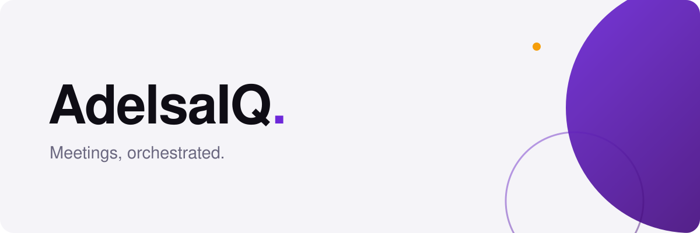

  <picture>
    <source media="(prefers-color-scheme: dark)" srcset="banner-dark.svg">
    
  </picture>

# Intelligence for every meeting.

AdelsaIQ coordinates meetings that span **different
organizations and different calendar systems** — the case the platform-native
schedulers do not cover, because each of them assumes everyone is inside it.

Cross-organizational scheduling is mostly not a calendar problem. It is consent,
retention and jurisdiction: whose availability may be shown to whom, what a
booking record keeps, and which rules apply when the two parties sit under
different ones. The product is built around that, with per-workspace controls and
`hipaa` and `ferpa` presets rather than a single global setting.

Development happens in private while V1 moves toward general availability, ahead
of a closed beta. This page will list repositories when there are repositories
worth listing — not before.

## Get in touch

- Product, partnerships, or the beta:
  [support@adelsaiq.com](mailto:support@adelsaiq.com). The site is not live yet.
- Security: [security@adelsaiq.ai](mailto:security@adelsaiq.ai) — never a public issue.
  See the [security policy](https://github.com/adelsaiq/.github/security/policy).
- Anything else: [support@adelsaiq.com](mailto:support@adelsaiq.com).

Founded by [Danniela Gumo](https://github.com/dannielagumo).
